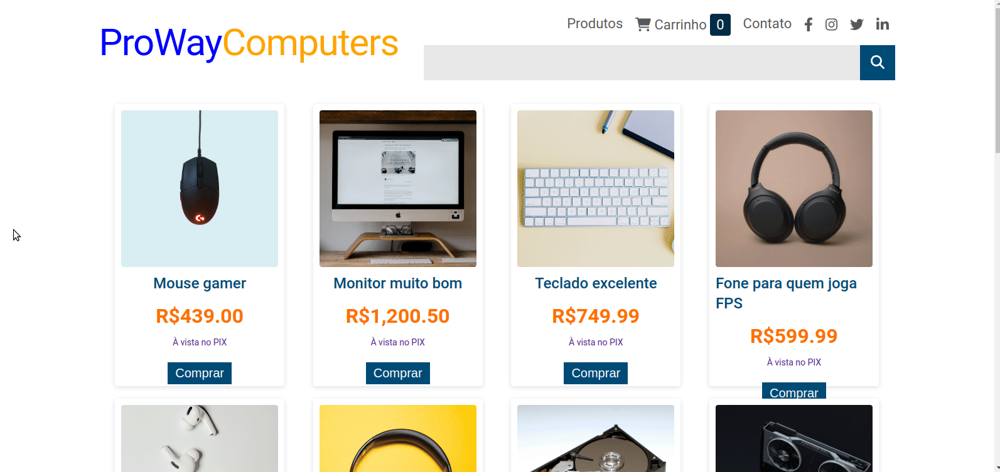

# About the project / *Sobre o projeto*

This is an Angular project developed for Capgemini's Start Program, where the objective is to build an e-commerce with all main features. The app allows view all products, product details, buy items, change quantity, search products, contact page with form validation.

---

*Este é um projeto em Angular desenvolvido para o Programa Start da Capgemini, onde o objetivo é construir um e-commerce com todas as principais funcionalidades. O aplicativo permite visualizar todos os produtos, detalhes do produto, comprar itens, alterar quantidade, pesquisar produtos, página de contato com validação do formulário.*

---
# Skills / *Habilidades*

  - Angular front-end development / *Desenvolvimento Front-end em Angular*
  - Components / *Componentes*
  - Modules / *Módulos*
  - Services / *Serviços*
  - Angular Material (snack-bar)
  - Form validation / *Validação de formulário*
  - Search bar / *Barra de pesquisa*
  - Cart / *Carrinho*

---
# Layout

---
# Deployment / *Implantação*

- run 'npm start' to start the server / *execute 'npm start' para iniciar o servidor*
- Access http://localhost:4200/ / *Acesse http://localhost:4200/*

